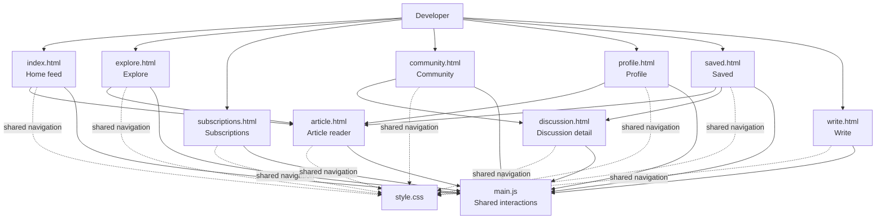
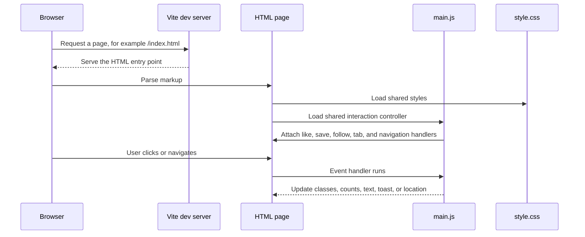
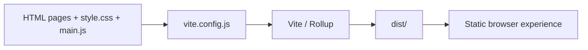
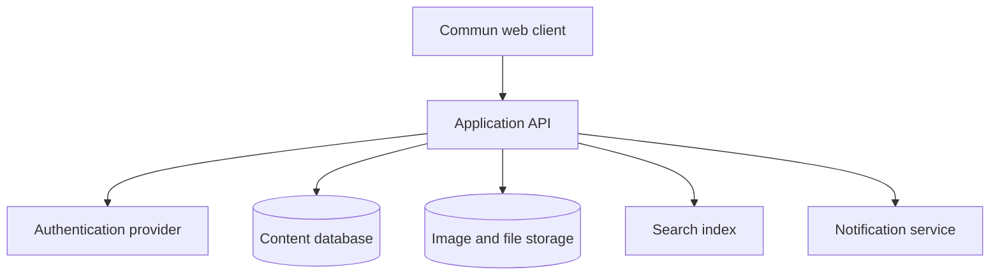

# Commun

Commun is a developer publishing and community platform prototype. It combines an editorial feed, technical articles, discussions, creator profiles, subscriptions, saved content, and a writing workspace in a focused multi-page interface.

## Features

- Browse a personalized developer feed.
- Explore topics, writers, and curated collections.
- Read technical articles with author details and related content.
- Start and read community discussions.
- Follow creators, like posts, and save content.
- View a creator profile and published work.
- Manage saved articles and discussions.
- Draft and publish technical writing through the writer interface.

## Technology

- HTML pages for the user-facing routes.
- Vanilla JavaScript for shared interactions.
- CSS for the visual system and responsive layouts.
- Vite 5 for local development and multi-page production builds.
- No backend, database, authentication, or external API is currently connected.

## Project Structure

```text
commun.dev/
├── index.html          # Home feed
├── explore.html        # Topic and creator discovery
├── subscriptions.html  # Following and subscription activity
├── community.html      # Discussion listing
├── discussion.html     # Discussion detail and replies
├── article.html        # Article reader
├── profile.html        # Creator profile
├── saved.html          # Saved articles and discussions
├── write.html          # Writing and publishing workspace
├── main.js             # Shared interaction controller
├── style.css           # Shared styles and responsive layout rules
├── vite.config.js      # Vite multi-page entry configuration
├── package.json        # Scripts and development dependency
└── .gitignore          # Local files excluded from Git
```

The `.agents/` directory is intentionally ignored because it may contain local tool configuration or credentials.

## Page Architecture



## Runtime Flow



## Shared Interaction Model

`main.js` runs after `DOMContentLoaded` and attaches behavior to elements by class name:

- `.btn-like`: toggles the liked state and adjusts the visible count.
- `.btn-save`: toggles the saved state and displays a toast message.
- `.btn-follow-sm`, `.btn-follow-main`: toggles Follow and Following labels.
- `.feed-tab`: switches the active feed tab visually.
- `.post-item[data-href]`: navigates to the referenced relative page.

These changes are currently held in the browser DOM only. Refreshing the page resets them because there is no persistence layer yet.

## Getting Started

Requirements:

- Node.js 18 or newer
- npm

Install dependencies:

```bash
npm install
```

Start the development server:

```bash
npm run dev
```

Vite opens the app at [http://localhost:5173](http://localhost:5173). The port is configured in `vite.config.js`.

Create a production build:

```bash
npm run build
```

Preview the production build:

```bash
npm run preview
```

The generated files are written to `dist/`.

## Build Architecture

Vite treats each major page as a separate HTML entry point. Rollup bundles these entries into `dist/` while preserving their relative links. Because the pages share one stylesheet and one JavaScript module, visual and interaction changes can be applied consistently across the platform.



## Current Limitations

- Content is static HTML rather than server-rendered or API-driven data.
- Like, save, follow, and tab state is not persisted.
- The write page does not publish to a backend.
- There is no user authentication or authorization.
- Search and topic filters are primarily presentation-level UI.
- No automated test suite is configured yet.

## Suggested Next Architecture

For a production version, retain the current page and styling structure while adding an API and persistence layer:



The first backend milestones would be authentication, article and discussion APIs, saved and follow relationships, and durable draft publishing.
